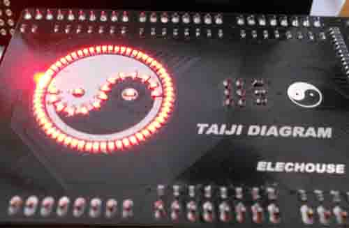

#TAJIUINO DUE#

[Taijiuino DUE](http://www.elechouse.com/elechouse/index.php?main_page=product_info&cPath=72_73&products_id=2214) is an Arduino-like board derives from [Arduino DUE](http://arduino.cc/en/Main/ArduinoBoardDue), it is designed by [Elechouse](http://www.elechouse.com).

[MORE](http://www.elechouse.com/elechouse/index.php?main_page=product_info&cPath=72_73&products_id=2214)  

## Details ##

### Hardware ###
**Schematic** and **Gerber files** of Taiji-Uino board.

### Software ###
Sample code to demonstrate how to use Arduino DUE

- **rtled** turn on *LEDRX* and turn off *LEDTX* for 0.5 second, then turn off *LEDRX* and turn on *LEDTX* for 0.5 second, repeatedly.
- **taijidiagram** Demonstrate how to make **Native USB** into a serial port, this program controls all the GPIOs to turn on or turn off the LEDs which are connected to the GPIO, work together with TaijiDiagram, is used to test the TaijiUino Due, a bit like this:

	

- **additional_pins** shows how to use TaijiUino additional pins.

## Additional Pins
As what you see, there are more pins on Taijiuino DUE board. On the backside some silkscreen is marked aside them.  
Because Arduino IDE does not support these pins, so to use these pins, you need do some hack things to enable them. 

### Patch Arduino IDE
- Download the **TAIJI-UINO** repository.
- In `patch/additional-pins-patch` folder, find `variant.cpp` and `variant.h`
- Open your Arduino IDE folder, and open `$ARDUINO/hardware/arduino/sam/variants/arduino_due_x` ($ARDUINO stands for the position of your Arduino IDE).
- In the `arduino_due_x` folder you can see `variant.cpp` and `variant.h`, rename this two files to `variant.cpp.bak` and `variant.h.bak`, in case of you want go back to the origin IDE.
- Copy the `patch/additional-pins-patch/{variant.cpp, variant.h}` to `arduino_due_x` folder
- Open `software/additional_pins/additional_pins.ino`, upload it to your Taijiuino DUE, then test it.

### Why need hack?
We aim at bringing you more pins, but origin Arduino IDE does not support it, so we just hack it.

### What change?
In `variant.cpp`, add description of the additional pins to the structure ` PinDescription g_APinDescription[]`, number of these pins are from 92 to 109.  
In `variant.h`, define macros help to remember the index value.
Access these pins use three ways(name, pin number, or alias):

	Name				Pin Number				 Alias
	PB24					103					  TP0
	PB23					104					  TP1
	PB22					105					  TP2
	PB27					106					  TP3
	PC20					107					  TP4
	PC10					108					  TP5
	PC11					109					  TP6
	---------------------------------------------------
	ERXD1   				98					  TP7
	ETXD1   				95					  TP8
	ERXER   				99				      TP9
	ERXDV  					96					  TP10
	EMDC    				100					  TP11
	ERXD0   				97					  TP12
	EMDIO   				101					  TP13
	ETXD0   				94					  TP14
	ETXEN   				93					  TP15
	EXINT   				102					  TP16
	ETXCLK  				92					  TP17
	CLKEN   				109					  TP6

Details in `variant.cpp` and `variant.h`.

### Example
	void setup(void)
	{
		// All this three lines do the same thing
		pinMode(PB23, OUTPUT);
		pinMode(103, OUTPUT);
		pinMode(TP0, OUTPUT);

		// All this three lines do the same thing
		digitalWrite(PB23, HIGH);
		digitalWrite(103, HIGH);
		digitalWrite(TP0, HIGH);
	}

	void loop(void)
	{
		//do nothing
	}
	
## Get files ##

    # get through GIT tools
    git clone https://github.com/elechouse/TAIJI-UINO.git
or

	# download the zip file

## Buy
[![elechouse][EHICON]][EHLINK]

[EHLINK]: http://www.elechouse.com

[EHICON]: https://raw.github.com/elechouse/CarDriverShield/master/image/elechouse.png